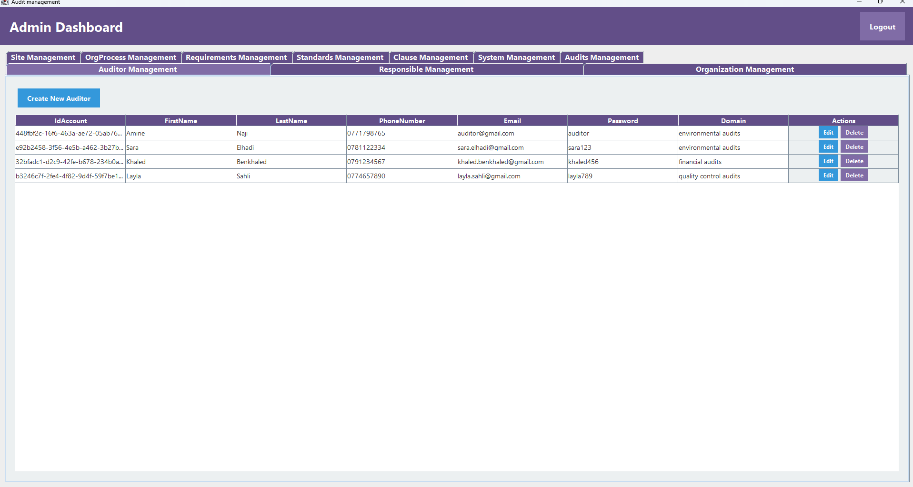

# Gestion_Des_Audits_Desktop_Java_Project_4iir - Readme

## Project Overview
### Admin Dashboard 


- [linkedin post](https://www.linkedin.com/posts/youbista_java-auditmanagement-json-activity-7289340095797559298-ZMFj?utm_source=share&utm_medium=member_desktop)

This project is an **Audit Management System** designed to help organizations efficiently manage audits, auditors, and compliance with recognized standards. The system provides a user-friendly interface with features for managing audit processes, generating reports, and tracking corrective actions. The application is built using **Java** for the desktop environment, ensuring robust performance and ease of use for audit teams. Data is stored and managed using **JSON** files, making it lightweight and easy to deploy.

---

## Features

### Auditor Dashboard
- **Manage Audits**: 
- **Pass Audits to Companies**: Auditors can assign audits to specific companies or organizations.
- **Track Audit Progress**: View the status of ongoing audits and their results.

### Admin Dashboard
- **Manage Management Systems**
- **Manage Standards**
- **Manage Requirements**
- **Manage Clauses**
- **Manage Processes**
- **Manage Sites**
- **Manage Organizations**
- **Manage Audits (CRUD)**
- **Manage Auditors**

### Data Storage
- **JSON Data Storage**: All data (audits, auditors, standards, clauses, etc.) is stored in JSON files, making the system lightweight and easy to manage.
---

## Technologies Used

- **Programming Language**: Java (for desktop application development).
- **Data Storage**: JSON files (for storing and managing data).
- **Version Control**: Git/GitHub (for code collaboration and version control).
- **Development Environment**: IntelliJ IDEA or Eclipse (for Java development).
- **UML Modeling**: Used for system design and documentation.

---

## Base Code

The base code for the project is structured around the following key components:

- **Main Application**: The entry point for the desktop application.
- **Data Layer**: Handles all data interactions using JSON files.
- **Business Logic Layer**: Implements the core functionality of the audit management system.
- **User Interface**: Provides a graphical interface for users to interact with the system.

---

## Installation and Setup

### Prerequisites

- **Java Development Kit (JDK)**: Ensure you have JDK 8 or higher installed.
- **Git**: For cloning the repository.

### Steps to Run the Project

1. **Clone the Repository**:
   ```bash
   git clone https://github.com/ayoubmajid67/audit-management-system_4iir.git
   cd code
   ```

2. **Run the Application**:
   - Open the project in your preferred Java IDE (IntelliJ IDEA or Eclipse).
   - Build the project and resolve any dependencies.
   - Run the `PageSwitcher.java` file to start the application.

3. **Access the Application**:
   - The application will launch as a desktop application. Use the provided login credentials to access the system [`data/Accounts.json`].

---

## UML Diagrams

The system design is documented using **UML diagrams**, including:

- **Use Case Diagrams**: Describe the interactions between users (auditors, admin) and the system.
- **Class Diagrams**: Represent the structure of the system, including classes, attributes, and relationships.
- **Sequence Diagrams**: Show the flow of interactions between system components.

---

## Contributors

- [Ayoub Majjid](https://www.linkedin.com/in/youbista/)
- [Iliass Wakkar](https://www.linkedin.com/in/iliass-wakkar/)
- [Rochdi Mohamed Amine](https://www.linkedin.com/in/rocmine/)

---

For any questions or issues, please contact us at [ayoubmajid71@example.com].

---

This project is designed to streamline the audit management process, ensuring compliance with standards and improving organizational efficiency. The use of JSON for data storage makes it lightweight and easy to deploy, while the modular structure ensures scalability for future enhancements.
